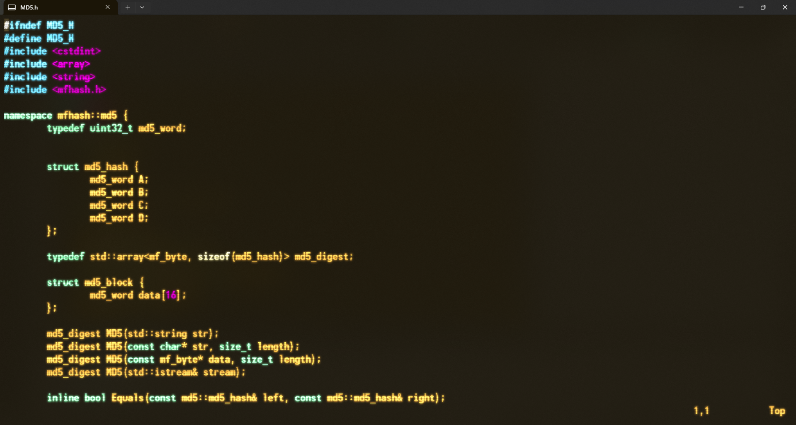
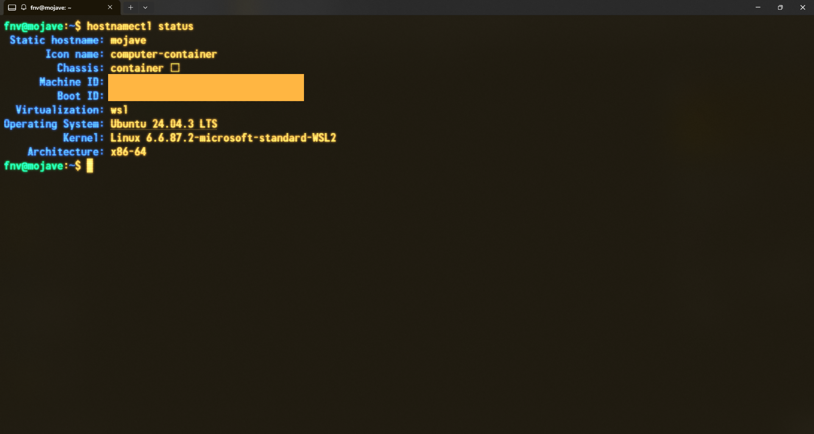
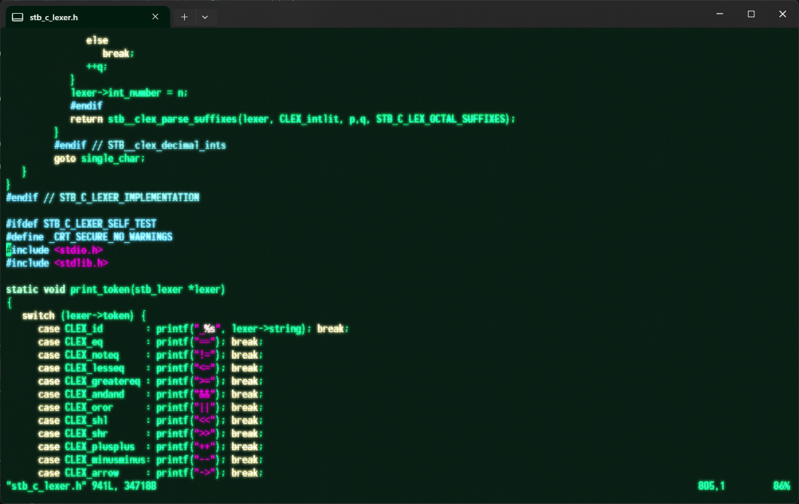

# My fork of Amber-theme for [Windows Terminal](https://github.com/Microsoft/Terminal)
Made to resemble **Fallout NV / Fallout 3** pip boy theme with actual game colors and font (manual installation, link provided)  
Read the [installation instructions](#installation-instructions)

# Installation instructions
**FNV/FO3 Font download** (optional, free) https://www.1001fonts.com/download/monofonto.zip  
(License forbids uploading the font file)  

### Auto
- Download `git clone https://github.com/fnpngn/falloutnv-win-term.git`
- Open terminal inside folder
- `./install.ps1`
- Close **all** open terminal windows (restart terminal)
- `Settings -> Profiles -> FNV-Amber -> Appearance -> Font Face` select `monofonto`(if installed)

### Manual
- Copy `Amber-theme.json` 
- `Win + R`, type `%localappdata%\Microsoft\Windows Terminal` ENTER
- Create `Fragments` folder if it does not exist
- Create a theme folder: `Fragments/FNV-Amber`
- Put **one** of the theme json inside the folder
- Close all open terminal windows (restart terminal)
- You should have a profile available with this theme as well as a theme itself on the list

# Issues 

## No theme effect
1. Make sure the theme has been installed and is ON under Settings -> Extensions
2. If no color is applied: you are using a default or custom profile, NOT the theme provided profile  
If you want to use this (or any) theme on a custom profile you need to manually select it:
`Settings -> Profiles -> Defaults (or your current profile) -> Appearance -> Color Scheme` select FNV-Amber

## No CRT filter / cursor / 
3. If no CRT filter / cursor / too many ripples in the background
You are not using the full theme profile.  
The **CRT filter** as well as **correct background settings** and **cursor** are part of the `PROFILE` settings
If you are trying to use `Default` or a `Custom` profile you can either copy the `"profiles"` section from the theme directly into your `settings.json`
Or follow the instructions:

`Settings -> Profiles -> Defaults -> Color Scheme` set to this theme
`Settings -> Profiles -> Defaults -> Retro terminal effects`: **ON**
`Settings -> Profiles -> Defaults -> Font face` set to monofonto (if installed, alternative: Unispace) 
`Settings -> Profiles -> Defaults -> Font size` at least 13, most people would like 15+
`Settings -> Profiles -> Defaults -> Cursor shape` Filled box
`Settings -> Profiles -> Defaults -> Cursor color` `#FFB642`(FNV) / `#1AFF80` (FO3) (part of theme but could get overriden by Defaults) 

# Uninstallation
Just delete `%localappdata%\Microsoft\Windows Terminal\Fragments\{installed theme}`  
Or toggle off in `Settings -> Extensions` and update profiles that use it

